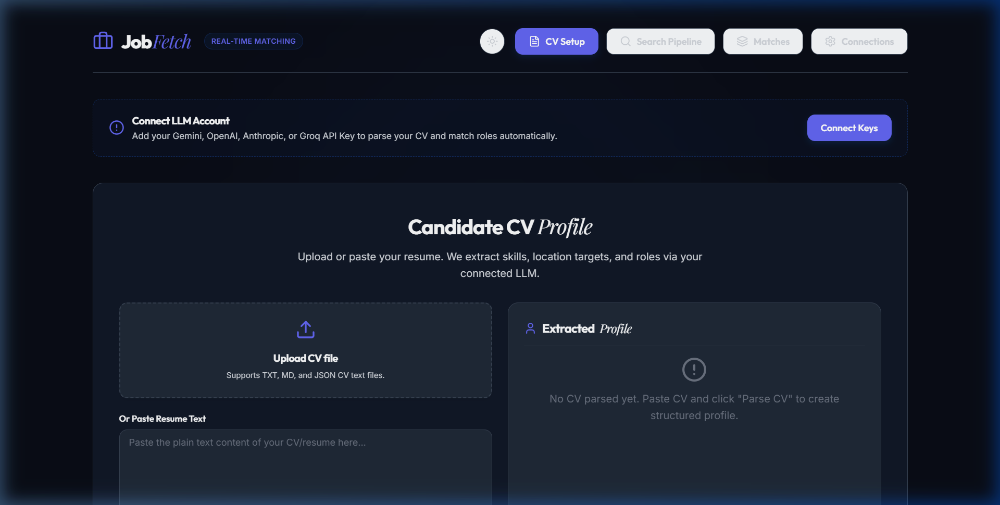
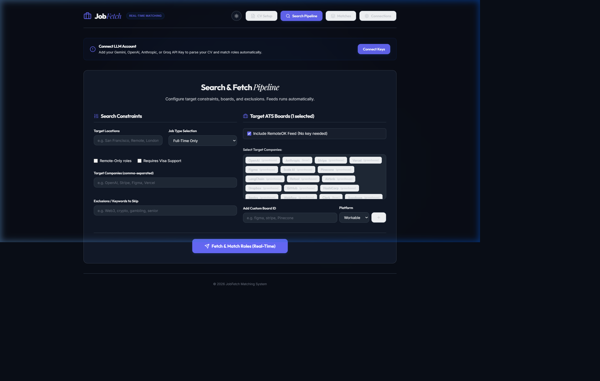
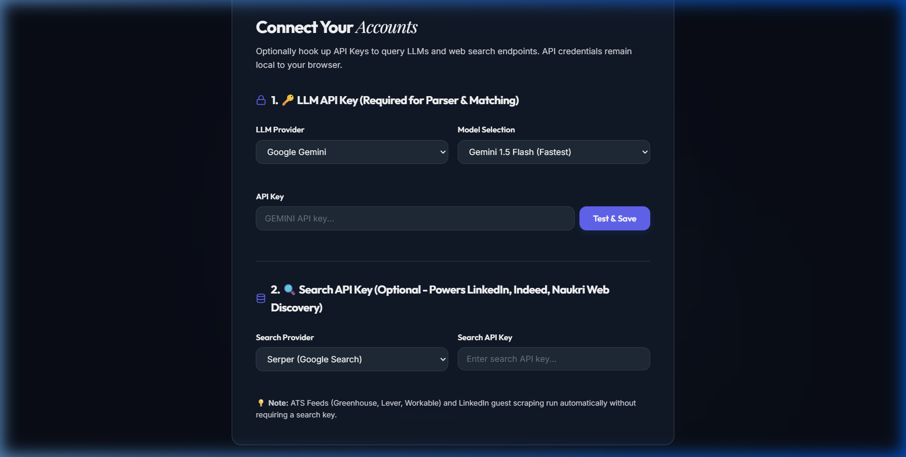

# JobFetch - Real-Time AI Job Matching Agent

JobFetch is a premium, real-time AI-powered job search discovery and matching agent. It takes your raw CV, parses it into structured candidate profiles using state-of-the-art LLMs, crawls public Applicant Tracking Systems (ATS) and job search portals in real-time, and streams evaluated matches ranked by relevancy.

---

## 🚀 Key Features

* **Structured CV Parser**: Extract expert/proficient skills, years of experience, target roles, locations, and visa preferences from `.txt`, `.md`, or `.json` resumes.
* **Public ATS Discovery (No API Keys Required)**: Searches and fetches public career feeds of top companies across **Greenhouse**, **Lever**, and **Workable** boards automatically.
* **LinkedIn Guest Scraping**: Dynamically queries the public LinkedIn guest job crawler endpoint without needing user authentication or account logins.
* **Multi-Provider Account Connections**: Support for major LLM providers (**Google Gemini**, **OpenAI**, **Anthropic**, **Groq**) and Search APIs (**Serper**, **Brave**, **Tavily**) stored safely in browser localStorage.
* **NDJSON Streaming**: Delivers progress logs and scored job results in real time over chunked HTTP transfer streams, updating candidate match scoreboards instantly.
* **Modern Interface**: Dual light and high-contrast dark theme, custom typography, smooth micro-animations, and visual score indicators.

---

## 📸 Interface Preview

### 1. Resume Setup & Parsing (Light Mode)
Upload your CV or paste raw resume text. The parsing agent extracts skills and experience domains automatically.



---

### 2. Search Constraints & Pipeline Controls (Dark Mode)
Define target locations, type constraints, exclusions, and input custom comma-separated target companies.



---

### 3. Connections & Credentials Panel
Securely verify and configure LLM and Search providers for parsing and matching.



---

## 🎨 Verification & Images Workflow

We maintain a strict visual verification workflow inside this repository:
1. **Automated Auditing**: During changes to UI colors, components, or layout constraints, a browser subagent acts as an end-to-end auditor.
2. **Visual Snapshots**: The subagent navigates tabs, toggles themes, and captures high-resolution screenshots.
3. **Asset Compilation**: Screenshots are automatically saved to the `assets/` folder to ensure documentation in this `README.md` stays synchronized with the latest interface revisions.

---

## 🛠️ Local Installation & Running

### Prerequisites
* [Node.js](https://nodejs.org) (v18+ recommended)
* [npm](https://npmjs.com)

### Steps
1. **Install dependencies**:
   ```bash
   npm install
   ```

2. **Run both servers simultaneously (Express Backend + Vite Frontend)**:
   ```bash
   npm run dev:all
   ```

3. **Access the application**:
   * Open your browser to **[http://localhost:5173/](http://localhost:5173/)**
   * The Express API listens on port `5000` (requests are proxied automatically).

4. **Production Build**:
   ```bash
   npm run build
   ```
